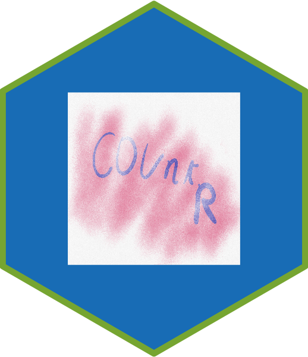

# Introduction

In this assignement I created a heaxagone logo using hexSticker.

# Required 

- R
- R studio
- hexSticker

# Code description

```
# Creat-a-Hexagone-logo-for-an-R-package

# Install hexSticker

library(hexSticker)

#  Create Logo using hexsticker

imgurl=system.file("/Users/nikhil/Downloads/IMG_0039.png", package="hexSticker")
sticker("/Users/nikhil/Downloads/IMG_0039.png", package="", p_size=8, s_x=1, s_y=1, s_width=.6,
        filename="aa.png")
```
# Screen recording 




# Author
-Nikhil
